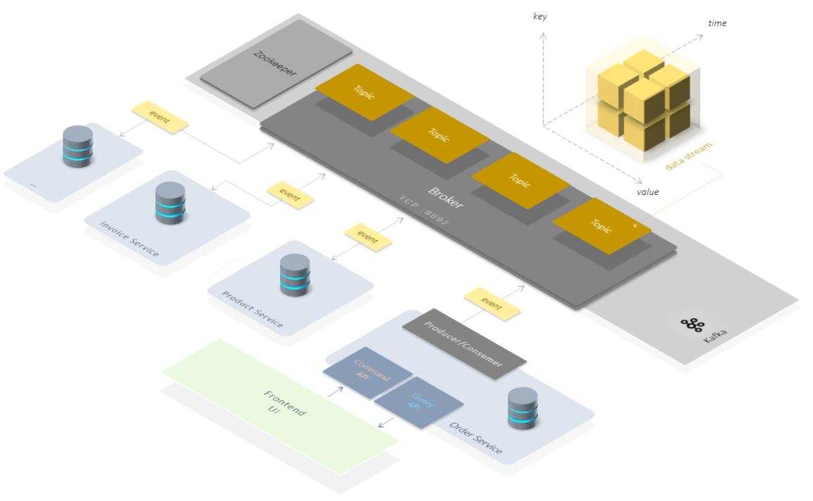

# Kafka

A series of tiny examples around the **Kafka** and **event driven microservices** implemented in Kotlin



- [why](#why)
- [the goal](#the-goal-of-this-project)
- [samples](#sample-projects)  
  - [hello kafka](#hello-kafka)
  - [hello kafka streams](#hello-kafka-streams)
  - [hello kafka microservices](#hello-kafka-microservices)
  - [hello kafka cqrs](#hello-kafka-cqrs)
  - [hello kafka event sourcing](#hello-kafka-event-sourcing)    
  - [hello kafka saga](#hello-kafka-saga)    
  - [hello kafka connect](#hello-kafka-connect)
- [set up a local Kafka environment](#set-up-a-local-kafka-environment)
  - [prerequisites](#prerequisites)
  

<br/><br/>

## Why

The world of software development is currently experiencing a radical change.
Technologies such as Docker, Kubernetes or Kafka, but also paradigms such as event driven microservices are being used more and more widely.
Not least because companies like Google, Facebook, LinkedIn or Amazon have achieved a great competitive advantage in recent years.

The great advantage of these technologies and the new approaches lies in their scaling.
This does not necessarily mean the runtime performance of an application, but rather the
Scaling the business model. Above all, the scaling of the actual software development process.
The point is that you no longer have to develop a platform with **ONE LARGE IT team**. Instead, many smaller teams can work in parallel and without any major arrangements
bring different parts of an application into production very quickly and effectively and operate them there.

Decentralization and loose coupling bring the advantage not only  in the code or in the infrastructure operation,
but above all in the organization.

<br/><br/>

> One of the reasons why this project was started, because it is very difficult to find really simple **Microservices + Kafka** examples.
> Most of the code examples are very complex and try to explain the use of Kafka in depth.
> All the details are of course important to be able to master a subject well at the end of the day. However, this level of detail makes difficult to get started.
> This project does not claim to fully explain the world of Kafka in its epic depth of detail.
> 
> This project aims to be a smooth and easy entry into the wonderful world of **"event driven microservices with Kafka"**. Namasté.🧘
 
<br/><br/>

## The goal of this project

The goal of this project is to gain technical understanding in development
of event driven microservices with Kafka.

these are the specific goals:

1. Basic understanding of the Kafka system 
2. understanding of Stream processing.
3. Understanding of the event driven microservice approach using Kafka.
4. implementation of architectural patterns(CQRS, ES, SAGA...) made using kafka


The following implementation examples are built iteratively 
so that you can reach the big goal with small steps.


<br/><br/>


   
## sample projects

This repo contains several projects.
<br/><br/>

<a name="hello-kafka"></a>

### [hello **kafka**](hello-kafka) <br/>
a simple publish/subscribe sample using Kafka + Spring + Kotlin + Gradle

<br/><br/>

<a name="hello-kafka-streams"></a>

### [hello **kafka streams**](hello-kafka-streams) <br/>
a simple Kafka data streaming example using  Kafka + Spring + Kotlin + Gradle

Kafka Streams Api is not an additional runtime component of the Kafka system itself,
but rather a library + architectural pattern. There is a separate lib or several different implementations for each technology stack(Java, Node/TypeSCript, Python..)


<br/><br/>

<a name="hello-kafka-microservices"></a>

### [hello **kafka microservices**](hello-kafka-microservices) <br/>
a simple event driven microservices example using  Kafka + Spring + Kotlin + Gradle +  H2

There are 2 essential points that make up event-driven microservices:

1. Each service has its own database
2. The services do not call each other via. REST or HTTP.
   Instead, they only communicate with each other via events.

This guarantees maximum decoupling. This decoupling/autonomy makes
an event driven microservice to a **more maintainable** microservice. 
Kafka is ideally suited as an event bus to ensure communication between the microservices.

<br/><br/>

<a name="hello-kafka-cqrs"></a>

### [hello **kafka cqrs**](hello-kafka-cqrs) <br/>
a minimal CQRS microservice implementation using Kafka + Spring + Kotlin + Gradle + H2

The purpose of CQRS (Command-Query-Responsibility-Segregation) lies in the decoupling of read and write operations.
The communication between the decoupled Command- and Query-Services takes place by means of events. 


<br/><br/>

<a name="hello-kafka-event-sourcing"></a>

### [hello **kafka event sourcing**](hello-kafka-es) <br/>
a minimal Event Sourcing implementation  using Kafka + Spring + Kotlin + Gradle

event sourcing makes microservices more scalable and more resilient. And all of that by design. Kafka can be used excellently as an event store.
<br/><br/>

<a name="hello-kafka-saga"></a>

### hello **kafka saga**
<!-- [hello-kafka-saga](hello-kafka-saga) <br/> -->
a minimal SAGA pattern implementation using Kafka + Spring + Kotlin + Gradle + H2

*...coming soon*

<br/><br/>


<a name="hello-kafka-connect"></a>

### hello **kafka connect**

<!-- [hello-kafka-connect](hello-kafka-connect) <br/> -->
a minimal Kafka Connect implementation using Kafka + Spring + Kotlin + Gradle + H2

*...coming soon*

<br/><br/>

## setting up a local Kafka environment

### prerequisites

- docker/docker-compose
- local dns mapping: 127.0.0.1 kafka

<br/><br/>

An executable Kafka environment consists in a minimal variant of at least 2 components:

- Kafka Broker (a single Node of a Kafka cluster :9092)
- Zookeeper (shared Configuration/ACL/health Service)


This project provides a docker-compose.yml to run a complete Kafka environment locally.
In addition, the docker-compose.yml contains a web UI for managing the Kafka system. The web UI is
after a successful start of the docker-compose at http://localhost:8081
There you can also create topics, write and read messages.


> The Kafka environment absolutely needs a host name (KAFKA_ADVERTISED_HOST_NAME) this is already in docker-compose.yml
> configured as **"kafka"**.
> 
> So you need a DNS entry in the local etc / hosts file:
> 
> 127.0.0.1  kafka

With docker-compose the Kafka environment can be started and stopped. In the individual projects, depending on the environment
the individual tasks are provided that wrap the actual docker-compose command.

```bash

docker-compose -f docker-compose.yml up -d   # start kafka environment
docker-compose down                          # stop kafka environment
  
```

<br/><br/>


