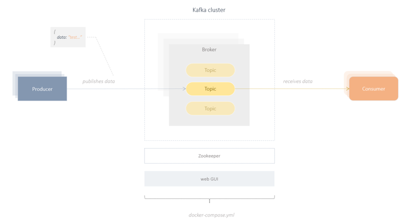

# Hello Kafka 
a tiny publish/subscribe example using Kafka + Spring + Kotlin + Gradle



# Example

This example demonstrates a very simple use of publish/subscribe in Kafka.
There are only 2 components, Producer and Consumer. Both are implemented as Spring @Services and run completely asynchronously.
The two components could also be outsourced to separate applications or 2 separate processes.

<br/><br/>

### Producer

The producer sends a new message(a simple string) every second to a Kafka topic called **hello-topic**
For checking purposes, the timestamp is appended:

```bash
SEND    MESSAGE : hello kafka 2021-05-24T13:32:49.086
```

The implementation of the producer is really very easy, especially thanks to Spring:

```kotlin
@Scheduled(fixedRate = 1000)
fun send() {
    val message: String = "hello kafka  " + LocalDateTime.now().toString()
    println("SEND    MESSAGE : $message")

    this.kafka.send("hello-topic", message)   // val kafka: KafkaTemplate<String, String> a generic injectable height level Spring Component 
}
```

<br/><br/>

### Consumer

The consumer subscribes to the topic **hello-topic** and receives a new message(a string) 
every time it arrives in the Kafka topic.

```bash
RECEIVE MESSAGE : hello kafka 2021-05-24T13:32:49.086
```

The implementation of the consumer is also very simple:

```kotlin
    @KafkaListener(topics= ["hello-topic"], groupId = "kafka_kotlin_id")
    fun consume(message: String) {
        println("RECEIVE MESSAGE : $message");
    }
```

<br/><br/>

### alternative implementation

In the example, **KafkaTemplate** is used to send messages.
This is a preconfigured height level component provided by the Spring Framework.

Alternatively, you can also use the low level component **KafkaProducer** to send messages.
However, this requires some parameters that have to be preconfigured before messages can be sent to Kafka:

```kotlin

 
        val map = mutableMapOf<String, String>()
        map["key.serializer"] = "org.apache.kafka.common.serialization.StringSerializer"
        map["value.serializer"] = "org.apache.kafka.common.serialization.StringSerializer"
        map["bootstrap.servers"] = "localhost:9092"
        
        val producer = KafkaProducer<String, String>(map as Map<String, Any>?)
        producer.send(ProducerRecord("hello-topic", message))

```

The same applies to the consumer. There is also the low level component **KafkaConsumer** with which you can receive messages.

<br/><br/>


## run sample

### prerequisites

- docker/docker-compose
- gradle
- java sdk 1.8
- kotlin
- local dns mapping: 127.0.0.1 kafka

<br/><br/>

```shell
                                          # 1. get project sources from git
git clone https://github.com/thecodemonkey/kafka-microservices.git      

                                          # 2. local dns setup => etc/hosts => 127.0.0.1  kafka

cd  hello-kafka                           # 3. go to project root folder  

gradle start-kafka                        # 4. start kafka infrastructure(zookeeper, kafka, web gui) as docker containers.
                                          # see docker-compose.yml for more details

gradle bootRun                            # 5. start publish and subscribe process (sends messages to and receives messages from kafka)


```

see console output:

```bash
SEND    MESSAGE : hello kafka 2021-05-24T13:32:49.086
RECEIVE MESSAGE : hello kafka 2021-05-24T13:32:49.086
```

<br/><br/>


-----

## About Kafka API

...


