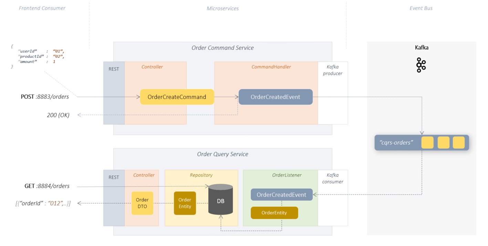

# Hello Kafka CQRS 

a minimal CQRS microservice implementation 
using Kafka + Spring + Kotlin + Gradle + H2




## Example

in this example the CQRS pattern is implemented. 
The purpose of CQRS (Command-Query-Responsibility-Segregation) lies in the decoupling of
read and write operations. To demonstrate this decoupling, 
2 separate services **order-query-service** and **order-command-service** were implemented in this example.

In the example, an order can be sent via the command service and queried via the query service.

<br/><br/>

### Order-Command-Service
Order-Command-Service provides a REST API for creating and changing orders:

    POST: /orders
    PUT:  /orders

The order commands(simple DTO's) sent to the REST endpoint are transformed into order events in the **CommandHandler**. 
Then the order events published to the Kafka topic **cqrs-orders**.

>The order command service runs on its own port: 8883 and has no access to any of the database
>and it does not call the query service either. The service also exclusively uses its own data models.
> 
> **This service is decoupled.** 
> 
> The only existing link is the connection to the Kafka Topic **cqrs-orders**


### Order-Query-Service

Order Query Service consists of 2 components. The asynchronous OrderListener that subscribes to the Kafka topic **cqrs-orders**
and processes all received OrderEvents. The corresponding changes (order events) to the orders are persisted in the local DB (H2).
The local DB therefore always contains the current status of all orders. The change history, on the other hand, is in the Kafka topic "cqrs-orders".
<br/><br/>

>The order query service also runs on its own port: 8884 and has access to its own local DB.
>The Query Service does not call the Command Service either. The service also exclusively uses its own data models
> 
> **This service is decoupled.**
> 
>The only existing link is the connection to the Kafka Topic "cqrs-orders"

## start application

## prerequisites

- docker/docker-compose
- gradle
- java sdk 1.8
- kotlin
- local dns mapping: 127.0.0.1 kafka

<br/><br/>

```shell
                                        # 1. get project sources from git
git clone https://github.com/thecodemonkey/kafka-microservices.git     

                                        # 2. local dns setup => etc/hosts => 127.0.0.1  kafka

cd  hello-kafka-es-cqrs/kotlin          # 3. go to project root folder                       

gradle start-kafka                      # 4. start kafka infrastructure(zookeeper, kafka, web gui) as docker containers.
                                        # see docker-compose.yml fro more details

gradle :order-command-service:bootRun   # 5. start command service (provide REST Endpoint to receive OrderCommands. Publishes OrderEvents to the Kafka topic)
gradle :order-query-service:bootRun     # 6. start query service (listen to kafka topic for new order events and persist order changes to local db, provides a REST endpoint to query persisted orders)


```

## make an order and see what happens

```shell

# 1. create a new order (execute command) 
curl  --request POST 'http://localhost:8883/orders' --header 'Content-Type: application/json' --data-raw '{ "userId" : "0123", "productId": "777", "amount": 1 }'

# 2. get all available orders (execute query)
curl 'http://localhost:8884/orders'

```

<br/><br/>

---

## About CQRS

xxx
