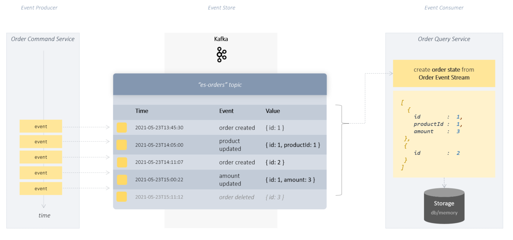

# Hello Kafka Event Sourcing with Streams

a minimal Event Sourcing implementation  
using Kafka Streams API + Spring + Kotlin + Gradle



## Example

xxx

<br/><br/>

### Order Command Service

The OrderCommandService creates a new order event every second and publishes this to the Kafka topic **"es-orders"**.
This is intended to simulate the continuous flow of data/events.

Different order updates are simulated: price change, quantity, product change.

The Command Service is really very simple and does not contain any
Event sourcing magic other than creating events.

This is where the Kafka system does most of the work. All order events published in the "es-orders-streams" topic are saved in chronological order.

> The command service itself does not contain its own database, nor does it call the consumer service directly.
> Kafka Topic "es-orders-streams" is the only link between these two services.

<br/><br/>

### Order Query Service

xxx

> The Query Service itself neither accesses a database nor does it call the Command Service.
> Kafka Topic "es-orders-stream" is the only link between these two services.
> The current state of the orders exists in the state store "es-orders-state", with is also a kafka topic. 
> When the service is started, the current state is always updated continuously 
> as long as the service is running.

The Kafka streams processor only needs the application-id:

```yaml

spring:
  kafka:
    streams:
      application-id: hello-es-streams

```

<br/><br/>

## start application

## prerequisites

- docker/docker-compose
- gradle
- java sdk 1.8
- kotlin
- local dns mapping: 127.0.0.1 kafka

<br/><br/>

```shell
                                        # 1. get project sources from git
git clone https://github.com/thecodemonkey/kafka-microservices.git    

                                        # 2. local dns setup => etc/hosts => 127.0.0.1  kafka

cd  hello-kafka-es/kotlin               # 3. go to project root folder                       

gradle start-kafka                      # 4. start kafka infrastructure(zookeeper, kafka, web gui) as docker containers.
                                        # see docker-compose.yml fro more details

gradle :order-command-service:bootRun   # 5. start command service (publishes random Order Events to the Kafka topic)
gradle :order-query-service:bootRun     # 6. start query service (listen to kafka topic for order events and restores order state in kafka state store, provides a REST endpoint to query(interactive query) current orders state)

```

## event sourcing in action

```shell

# 1. start producer/command service to create random order events 
gradle :order-command-service:bootRun

# 3. start query service to create current state of orders 
gradle :order-query-service:bootRun

# 5. get the current state of orders. 
curl 'http://localhost:8887/orders'
curl 'http://localhost:8887/orders/1'


```

<br/><br/>

---

## About Event Sourcing with Streams API

xxx

<br/><br/>
