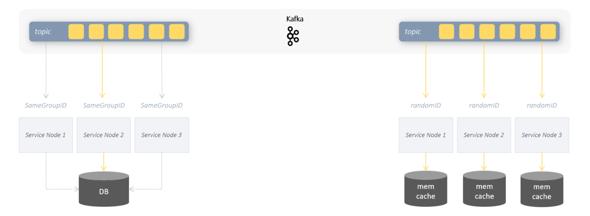

# Hello Kafka Event Sourcing 

a minimal Event Sourcing implementation  
using Kafka + Spring + Kotlin + Gradle


## Example

This example demonstrates the basic functionality of event sourcing using Kafka.
The example consists of 2 services. The **OrderCommandService** creates various order events in an endless loop and publishes them in the Kafka topic **"es-orders"**.
The **OrderQueryService** receives the events and uses them to determine the current state of the orders and keeps it in memory.
Since the consumer service in the example does not use a durable database and the current state of the orders only exists in RAM,
the advantage of **event sourcing** is becoming apparent. When the OrderQueryService is restarted, the consumer receives all events since the beginning of the recording and can 
run the entire event history in chronological order to establish the current orders state.

Since Kafka automatically stores all events in a chronological order in the topics, the system is ideally suited as an event store to operate event sourcing in a distributed environment.

<br/><br/>

### Order Command Service

The OrderCommandService creates a new order event every second and publishes this to the Kafka topic **"es-orders"**.
This is intended to simulate the continuous flow of data/events.

Different order updates are simulated: price change, quantity, product change.

The Command Service is really very simple and does not contain any
Event sourcing magic other than creating events.

This is where the Kafka system does most of the work. All order events published in the "es-orders" topic are saved in chronological order.
If a consumer subscribes to this topic, then, depending on the setting, he can be automatically notified of both the current and past events.

> The command service itself does not contain its own database, nor does it call the consumer service directly.
> Kafka Topic "es-orders" is the only link between these two services.


<br/><br/>

### Order Query Service

The actual task of the Query Service is to provide read access to the current order data.
The Query Service dispenses with any database and keeps the current orders in the RAM. The current state of the orders will be
determined from the event history and kept synchronized. To do this, the consumer **@KafkaListener** subscribes to the Kafka topic "es-orders".
Every time the Query Service starts, the @KafkaListener function receives all order events since the start of the recording.
The received events contain partial updates or the initial creates and are processed accordingly by the consumer.
So an order event that contains a price update also triggers a price update in the local order store of the service, etc.
And so the consumer carries out one event after the other and ensures that the current state of the orders
is restored and remains up to date.

> The Query Service itself neither accesses a database nor does it call the Command Service.
> Kafka Topic "es-orders" is the only link between these two services.
> The current state of the orders only exists in the RAM and only as long as the service is running.
> When the service is started, the current state is always restored from the event history and updated continuously as long as the service is running.

The Kafka consumer needs the following parameters for this:

```yaml

spring:
 kafka:
  consumer:

   # Each time the service is started, a new random Group-ID is generated.
   # Because the consumer does not persist the order state, but only holds it in memory
   # it must be ensured that at each start all past events
   # need to be processed again.
   group-id: ${random.uuid}

   # all events since the beginning of the recording should be received,
   # if they have not yet been picked up.
   # in combination with the random Group-ID it means that all events and with each restart
   # of the service are received.
   auto-offset-reset: earliest   
   ...
```

#### Consumer Group-ID


The consumer Group-ID identifies the single consumer or a group of consumers.
Every time a consumer receives an event or a record from the corresponding Kafka topic, the Kafka system saves(*by default, autocommit is true*) the offset of the record and the Consumer-ID. 
So Kafka knows which events have already been picked up by which consumer and which have not yet. A new consumer
who has never picked up anything can theoretically receive all past events. Whether he can really do that will
determined by the further parameter **auto-offset-reset**.



Using the same Group ID for several consumers can ensure that the event is only processed once.
This is useful if the consumers use the same database, for example.

If a consumer service uses a local cache as a state store, it should be ensured that
the consumer receives a new GroupID before start. So the past events can be processed on each start of the service.

<br/><br/>

#### auto offset reset

The parameter **auto-offset-reset** defines from which offset the consumer is to receive the events that have not yet been processed.

In this project the value will be:

auto-offset-reset: earliest

used. This ensures that all events of the topic are to be received.
Provided that they have not yet been processed and committed by the consumer.

<br/><br/>

#### enable-auto-commit

Auto commit is used in the examples. A manual commit would be used in real-world scenarios.
This can be done within the @KafkaListener function with the help of acknowledgment. 
As soon as the internal processing of the event is completed,
the current offset of the consumer in the Kafka system can be committed with *ack.acknowledge()*

```kotlin
    @KafkaListener(topics= ["es-orders"])
    fun consume(event: OrderEvent, ack: Acknowledgment) {
        
        // event processing
        ...
 
        ack.acknowledge() // commits the current offset
    }
```

<br/><br/>

## start application

## prerequisites

- docker/docker-compose
- gradle
- java sdk 1.8
- kotlin
- local dns mapping: 127.0.0.1 kafka

<br/><br/>

```shell
                                        # 1. get project sources from git
git clone https://github.com/thecodemonkey/kafka-microservices.git    

                                        # 2. local dns setup => etc/hosts => 127.0.0.1  kafka

cd  hello-kafka-es/kotlin               # 3. go to project root folder                       

gradle start-kafka                      # 4. start kafka infrastructure(zookeeper, kafka, web gui) as docker containers.
                                        # see docker-compose.yml fro more details

gradle :order-command-service:bootRun   # 5. start command service (publishes random Order Events to the Kafka topic)
gradle :order-query-service:bootRun     # 6. start query service (listen to kafka topic for order events and restores order state in memory, provides a REST endpoint to query current orders)

```

## event sourcing in action

```shell

# 1. start producer/command service to create random order events 
gradle :order-command-service:bootRun

# 2. stop producer/command service after 20sec. 
[CTRL + C]

# 3. start query service to create current state of orders 
gradle :order-query-service:bootRun

# 4. look at the console output. 
#    The consumer receives all order events since the beginning of the recording:

...
RECEIVE ...
RECEIVE MESSAGE : Order(id=2, userId=1, productId=null, amount=null, price=12)
RECEIVE MESSAGE : Order(id=1, userId=1, productId=null, amount=69, price=null)
RECEIVE ...
...

# 5. get the current state of orders. 
curl 'http://localhost:8885/orders'

# 6. start producer/command service again to continuously produce new order events
gradle :order-command-service:bootRun

# 7. see how the current state of the orders is constantly changing.  
curl 'http://localhost:8885/orders'

```

<br/><br/>

---

## About Event Sourcing

The difference between simple event-based communication and event sourcing is that the event history
plays an essential role in using event sourcing.

Without event sourcing, Kafka only acts as an event bus that receives and forwards events in real time. When a consumer is offline,
then he does not get these messages. It can happen that important data is lost as a result.

With event sourcing, on the other hand, the current state is determined again and again. It means that if the event store already contains past events, every new consumer can
build up your own current database from this event history and keep it synchronized. The consumer can also go offline and then back online after a while. The missing events are simply processed at the next start and the current state is restored.

> Event sourcing enables scalability and resilience by design!

However, you can also determine not only the current state, but also the state at a specific point in time, e.g. to operate data analytics or to debug errors in production.

<br/><br/>
