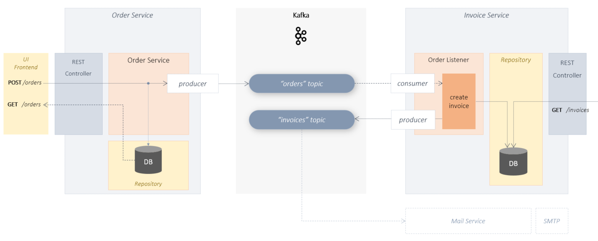

# Hello Kafka Microservices 
a minimal microservice implementation 
using Kafka + Spring + Kotlin + Gradle + H2



## Example

In this example, 2 microservices are implemented that communicate with each other using events.

> The services do not call each other and do not use a common database.
> They only communicate through events.

The Kafka system takes care of publishing and subscribing to such events.

In this example, event-based service communication is implemented.
However, there is no event sourcing. **Event history** plays an essential role in **event sourcing** .
In this example the event history is irrelevant. 
Only the one-time notification of the respective event is necessary.


### Order-Service

New orders can be created or queried via the order service.
A corresponding REST API is provided for this:
    
    POST /orders
    GET  /orders

The received order is first persisted in the local database.
An event is then published in the Kafka Topic.
Thus, all subscribers of this topic should be informed about this event.

<br/><br/>

### Invoice-Service

The invoice service subscribes to the relevant Kafka topic and receives all events that are published via it.
There is a corresponding OrderListener in the Invoice Service, which takes care of the processing of order events.
On the basis of each received order, a new InvoicesEntity is created and persisted in the local DB of the Invoice Service.

In addition, a new "Invoice Event" is created and published in the corresponding Kafka Topic. 
This should also notify all relevant services about the creation of a new invoice. 
You could now implement another Service for example **Mail Service** who subscribes to the **"Invoice" topic** and 
takes care of sending the e-mails.

The invoice service also provides its own REST API. For example, frontends can use this to query all invoices.
<br/><br/>


## start application

## prerequisites

- docker/docker-compose
- gradle
- java sdk 1.8
- kotlin
- local dns mapping: 127.0.0.1 kafka

<br/><br/>

```shell
                                        # 1. get project sources from git
git clone https://github.com/thecodemonkey/kafka-microservices.git    

                                        # 2. local dns setup => etc/hosts => 127.0.0.1  kafka

cd  hello-kafka-microservices/kotlin    # 3. go to project root folder                       

gradle start-kafka                      # 4. start kafka infrastructure(zookeeper, kafka, web gui) as docker containers.
                                        # see docker-compose.yml fro more details

gradle :order-service:bootRun           # 5. start order service (provide REST Endpoint to create new Orders or select the existing. Publishes OrderEvents to the Kafka topic)
gradle :invoice-service:bootRun         # 6. start invoice service (listen to kafka topic for new order events, create new Invoices and persist Invoice changes to local db, provides a REST endpoint to query persisted invoices)


```
<br/><br/>

## make an order and see what happens

```shell

# 1. create a new order (execute command) 
curl  --request POST 'http://localhost:8881/orders' --header 'Content-Type: application/json' --data-raw '{ "userId" : "0123", "productId": "777", "amount": 1 }'

# 2. get all available orders 
curl 'http://localhost:8881/orders'

# 3. get all available invoices
curl 'http://localhost:8882/invoices'

# 4. check topic with Kafka UI
#    open in browser: http://localhost:8081/

```

<br/><br/>

----

## About event driven microservices

The complexity of an application does not necessarily increase by the number of lines of code,
but by the dependencies. These dependencies arise, for example, through the use of a common data model,
or by the use of a common database. But also, if one outsourced the whole code into several smaller services, so
dependencies can arise from the fact that the services call each other.
The event-driven approach enables maximum decoupling. The services communicate with each other exclusively by means of events.   

There are 3 essential points that make up event-driven microservices:

- Each service has its own database
- The services do not call each other via. REST or HTTP, Instead, they only communicate with each other via events.
- The services do not use common data models

This guarantees maximum decoupling. This decoupling/autonomy makes an event driven microservice to a more maintainable microservice. Kafka is ideally suited as an event bus to ensure communication between the microservices.
<br/><br/>
