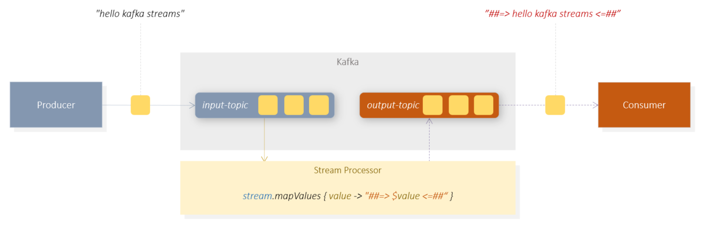

# Hello Kafka Streams

a tiny **Stream Processing** example using Kafka + Spring + Kotlin + Gradle




## Example 

This example implements a simple skeleton of an application for processing data streams.

It demonstrates a simple use of Kafka Streams API.

4 essential components are used for this:

1. Kafka 
2. Producer (sends a new message to the 'input-topic' every second)
3. **Processor** (continuously reads the data stream from the 'input-topic', changes the message and sends it to a new topic 'output-topic')
4. Consumer (continuously reads the data stream from the 'output-topic' and prints the record to the console.)

> This is a low level example to first demonstrate the basic functionality of Stream Processing with Kafka.
> To keep the example simple, all components (consumer, processor and producer) were implemented in a Spring application
> You can easily outsource the individual components to separate Spring applications.
> 
<br/><br/>

### Producer

The producer is similar to the one implemented in the [Hello Kafka](../hello-kafka) example.
Every second a new text message is published to the **"input topic"**.
Spring Framework configures the producer with default settings,
so that no further special configurations are required here.

```kotlin
@Service
@EnableScheduling
class Producer(val kafka: KafkaTemplate<String, String>) {
    
    @Scheduled(fixedRate = 1000)
    fun send() {
        val message: String = "hello kafka  " + LocalDateTime.now().toString()
        println("SEND    MESSAGE : $message")
        this.kafka.send("hello-topic", message)
    }
}
```

<br/><br/>

### Consumer

The consumer subscribes to the **"output-topic"**. This ensures that only those through
Stream Processor already processed data are received. Default settings are also used here
by the consumer.

Spring takes a lot of work off here too and reduces the code to a minimum.

```kotlin
@Service
class Consumer() {

    @KafkaListener(topics= ["output-topic"], groupId = "kafka_kotlin_id")
    fun consume(message:String) : Unit {
        println("receive    MESSAGE : $message at ${LocalDateTime.now()}");
    }
}
```

<br/><br/>

### Processor

The task of the *stream* **Processor** is the real-time transformation of the data.
A **StreamBuilder** is used for this, which subscribes to one or more topics
and generates a data stream (KStream) at runtime.

In this example, StreamBuilder subscribes to the **"input-topic"**. 
The messages are transformed with mapValues.
The transformed message is then published to the **"output-topic"** using the api call **.to()**.

```kotlin
@Service
@EnableKafkaStreams
class Processor {

    @Bean
    fun processSimple(builder: StreamsBuilder): KStream<String, String> {
        val stream: KStream<String, String> = builder.stream("input-topic")

        stream.mapValues { value -> "##=> $value <=##" }                      // transform each record of the stream
              .peek { _, i -> println("process    MESSAGE in stream: $i") }   // outputs something in the console. debugging only
              .to("output-topic");                                            // publishes the transformed records to another topic

        return stream
    }
}
```


The processor needs the following configuration (* application.yml *):

```yaml
spring:
  kafka:
    streams:
      # same as group id for consumer
      application-id: hello-streams
      properties:
        #default serde have to be changed from Bytes to String
        default.key.serde: org.apache.kafka.common.serialization.Serdes$StringSerde
        default.value.serde: org.apache.kafka.common.serialization.Serdes$StringSerde
```

The Spring Framework also makes things a lot easier at this point.


## run sample

## prerequisites

- docker/docker-compose
- gradle
- java sdk 1.8
- kotlin
- local dns mapping: 127.0.0.1 kafka

<br/><br/>

```shell

                                                     # 1. get project sources
git clone https://github.com/thecodemonkey/kafka-microservices.git      

                                                     # 2. local dns setup => etc/hosts => 127.0.0.1  kafka

cd  hello-kafka-streams                              # 3. go to project root folder  

gradle start-kafka                                   # 4. start kafka infrastructure(zookeeper, kafka, web gui) as docker containers.
                                                     # see docker-compose.yml

gradle bootRun                                       # 5. start publish, processing and consuming the data(sends messages to and receives messages from kafka). 
                                                     # on first run, pleas start => stop => start again.  

```

see console output:

```bash
publish  MESSAGE : hello kafka streams
process  MESSAGE in stream: ##=> hello kafka streams <=##
receive  MESSAGE : ##=> hello kafka streams <=##
```

Each of the 3 components (producer, processor and consumer) is generated
the corresponding console output.

> ATTENTION: The application must be started => stopped => and restarted again at the first time.
> This ensures that the topic "input-topic" is created before StreamBuilder subscribes to it.
> Typically, topics would be created before by the administrative process.
> To keep the examples simple, this has been omitted here.

<br/><br/>


---

## About Kafka Stream Processing

Stream processing implies that data streams are processed. But what exactly is **data stream**?
Is a data stream like an array or a list?
An array or a list is something static. Arrays have a specific size, a beginning and an end. Elements can be added, changed or deleted.
At the end of the day, an array is nothing more than a few bytes in RAM.


A data stream is something that is much larger than just a list in memory.
A data stream is something like an extremely long, extremely lively list distributed through many servers. A stream is subject to very specific rules.
As a rule, it gets bigger and bigger, because data is constantly being added and no more is coming out.
In addition, the existing elements are no longer changed. Data is usually not in RAM,
but are spread over several places. Data streams flow very quickly and can be extremely long.

Arrays are iterated, data streams are subscribed to.

> Data from a stream can be processed in real time by subscribing to events.
> Multiple data sources can be bundled into one stream, for example, to aggregate data.
> Subsequently, the aggregated data can flow into another stream, which in turn can be
> Processed by other subscribers.
> One can thus theoretically, create infinitely long processing chains,
> capable of processing large data streams at a very high speed in real time.
> This type of processing of data streams is called **stream processing**.

Stream Processing is an integral part of the Kafka DNA. This type of data processing is the reason why Kafka exists in the first place.
Kafka can persist ever growing streams of data, so not only the current,
but also the historical data can still be processed very performantly.
And this is what makes Kafka different from messaging or queuing systems, such as RabbitMQ or Radis.

<br/><br/>

### Processor Topology in Kafka

A logical unit that implements Kafka Stream Processing generally consists
of several individual processing steps. These are called processors.
They can receive streams (up-stream), but also generate downstreams, which can be processed by the other processors as upstreams.
The logical structure of such processors is called processor topology.

There are 2 special types of processors: Source Processor and Sink Processor.

The **Source Processors** subscribe to Kafka Topics and use them as initial data sources.
**Source processors** are the entry points in a processor topology.

The **Sink Processors** in turn publish their results to other Kafka Topics. They are the outputs.


You can read more about stream processing and processor topology here.
[Streams Architecture(Confluent)](https://docs.confluent.io/platform/current/streams/architecture.html#streams-architecture)


<br/><br/>

### Kafka Streams API

Kafka Streams API, as the name suggests, is an API. It is not an additional runtime component of the Kafka system,
but a program library. It contains everything needed to process data streams.

Kafka Streams API basically consists of 3 main components:

- **StreamsBuilder** (subscribes to topics, generates data streams and forwards them)
- **KStream<,>**     (API for data streams)
- **KTable<,>**      (KTables is something like a DB table in memory. In KTables states can be loaded and held. KTables can also be persisted.)

> Strictly speaking, the example uses Kafka Streams DSL. This is the height level Streams API.
> If this is not enough, you can use the low-level Processor API.

<br/><br/>


## references

[a good explanation of Kafka Streams API](https://betterprogramming.pub/learn-stream-processing-with-kafka-streams-stateless-operations-2111080e6c53) <br/>
[Streams Architecture(Confluent)](https://docs.confluent.io/platform/current/streams/architecture.html#streams-architecture)
