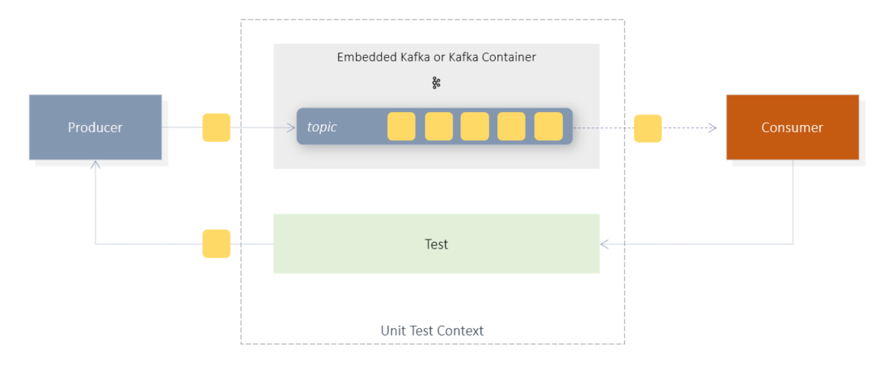

# Hello Kafka Unit-Test
a simple Unit-Test using Kafka + Spring + Kotlin + JUnit5




# Example

The example consists of 2 components: the runtime code and the corresponding unit tests.
The producer sends simple text messages to a Kafka Topic "hello-topic-ut". 
The consumer subscribes to the topic "hello-topic-ut" and receives automatically all messages 
sent to that topic.

> The magic of this example is that you don't need a running Kafka infrastructure.
> The unit tests provide Kafka Environment!

<br/><br/>

### Producer

The producer sends the text message to the topic "hello-topic-ut".

```kotlin
@Service
class Producer(val kafka: KafkaTemplate<String, String>) {
    fun send(message: String) {
        println("PUBLISH message: $message")
        this.kafka.send("hello-topic-ut", message)
    }
}
```

<br/><br/>

### Consumer

The consumer subscribes to the topic "hello-topic-ui" and thus automatically receives the messages.
The received messages are stored in memory so that they can be queried later in unit tests.

Furthermore, the consumer contains the CountDownLatch component which helps to cleanly test asynchronous
processing in the unit tests.

```kotlin
@Service
class Consumer {
    val data: MutableList<String> = ArrayList()
    var latch = CountDownLatch(2)

    @KafkaListener(topics= ["hello-topic-ut"], groupId = "kafka_kotlin_id")
    fun consume(message: String) {
        println("RECEIVE message: $message")
        data.add(message)
        latch.countDown()
    }
}
```

<br/><br/>

### Unit-Test

This example demonstrates 2 different ways,
how to implement Kafka unit tests:

- EmbeddedKafka
- Testcontainers/KafkaContainer

### dependencies

the following packages are used for this purpose.

```kotlin

    // build.gradle.kts 

    implementation("org.springframework.boot:spring-boot-starter")
    testImplementation("org.springframework.boot:spring-boot-starter-test")

    // embedded kafka
    implementation("org.springframework.kafka:spring-kafka")
    implementation("org.springframework.kafka:spring-kafka-test")

    // kafka as container
    implementation("org.testcontainers:kafka:1.15.0")
    implementation("org.testcontainers:junit-jupiter:1.15.0")

```

### EmbeddedKafkaTest

```kotlin

@SpringBootTest(properties = [
    "spring.kafka.consumer.auto-offset-reset=earliest",
    "spring.kafka.consumer.group-id=unit-test-client",
    "spring.kafka.bootstrap-servers=localhost:9099"
])
@DirtiesContext // resets the context between tests
@EmbeddedKafka(brokerProperties = ["listeners=PLAINTEXT://localhost:9099", "port=9099"])
class EmbeddedKafkaTest(
    @Autowired
    private val consumer: Consumer,
    @Autowired
    private val producer: Producer
) {


    @Test
    fun `should publish and receive 2 messages`() {
        val msg = "helllllo";

        consumer.latch = CountDownLatch(2)

        producer.send(msg);
        producer.send(msg);

        // wait max 2 sec. 
        consumer.latch.await(2000, TimeUnit.MILLISECONDS)

        assertThat(consumer.latch.count).isEqualTo(0)
        assertThat(consumer.data).isNotNull
        assertThat(consumer.data.count()).isEqualTo(2)
        assertThat(consumer.data[0]).isEqualTo(msg)
        assertThat(consumer.data[1]).isEqualTo(msg)
    }
}

```

### ContainerKafkaTest

```kotlin

@SpringBootTest
@DirtiesContext // resets the context between tests
@Testcontainers
class ContainerKafkaTest(
    @Autowired
    private val consumer: Consumer,
    @Autowired
    private val producer: Producer)
{

    companion object{
        @Container
        var kafka = KafkaContainer(DockerImageName.parse("confluentinc/cp-kafka:5.4.3"));
    }


    @Test
    fun `should publish and receive 2 messages`() { ... }

    @TestConfiguration
    internal class KafkaTestContainersConfiguration { ... }
}

```

<br/><br/>

## run sample

### prerequisites

- gradle
- java sdk 1.8
- kotlin

<br/><br/>

```shell
                                          # 1. get project sources from git
git clone https://github.com/thecodemonkey/kafka-microservices.git      

                                          # 2. local dns setup => etc/hosts => 127.0.0.1  kafka

cd  hello-kafka                           # 3. go to project root folder  

gradle test -i                            # 4. execute unit-tests


```

<br/><br/>

## references


- https://www.baeldung.com/spring-boot-kafka-testing
- https://www.testcontainers.org/
- https://www.baeldung.com/java-countdown-latch
