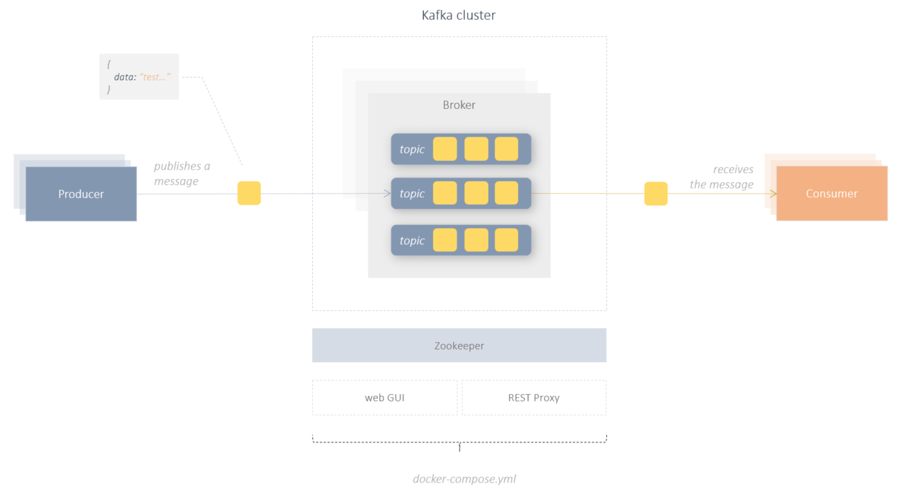

# Hello Kafka 
setting up a local kafka playground.



An executable Kafka environment consists in a minimal variant of at least 2 components:

- Kafka Broker (a single Node of a Kafka cluster :9092)
- Zookeeper (shared Configuration/ACL/health Service)

<br/><br/>

## Kafka as Docker

The easiest way to run Kafka locally is of course the Docker Container. Since we need a minimum of 2 services(Broker and Zookeeper), Docker-Compose is used here. 

To give further insight into the Kafka ecosystem, in addition to the core components, I have added another 2 optional services. A Kafka Web UI, which makes it very easy to administer Kafka and a REST Proxy, which makes it possible to access Kafka clusters using REST API. 

There are many different images available in the docker hub. I decided to use the following setup:

```yaml
#root/docker-compose.yml

version: "3.4"

services:

# kafka core components

  zookeeper:
    image: zookeeper:3.7.0
    ports:
      - "2181:2181"

  kafka:    # broker
    container_name: kafka  
    image: wurstmeister/kafka:2.12-2.5.0
    ports:
      - "9092:9092"
    depends_on:
      - zookeeper
    environment:
      KAFKA_ADVERTISED_HOST_NAME: kafka
      KAFKA_ADVERTISED_PORT: "9092"
      KAFKA_ZOOKEEPER_CONNECT: zookeeper:2181
      KAFKA_OFFSETS_TOPIC_REPLICATION_FACTOR: 1
      KAFKA_MESSAGE_MAX_BYTES: 104858800
    volumes:
      - /var/run/docker.sock:/var/run/docker.sock

# optional components

  kafka-rest:
    image: confluentinc/cp-kafka-rest:4.1.1
    hostname: kafka-rest
    ports:
      - "38082:38082"
    depends_on:
      - kafka
    environment:
      KAFKA_REST_ZOOKEEPER_CONNECT: zookeeper:2181
      KAFKA_REST_HOST_NAME: kafka-rest
      KAFKA_REST_LISTENERS: http://kafka-rest:38082

  kafka-web-gui:
    image: tchiotludo/akhq:0.17.0
    ports:
      - "8081:8080"
    environment:
      AKHQ_CONFIGURATION: |
        akhq:
          connections:
            docker-kafka-server:
              properties:
                bootstrap.servers: "kafka:9092"

```

## Broker

Kafka Broker is the heart of the Kafka system. Usually, brokers are operated in clusters.  
A broker is a single node of the cluster. The broker takes care of receiving, distributing and storing messages in the topics. Connected clients(Consumer, Producer) communicate with the broker via TCP:PORT.

<br/><br/>

## Topic

A topic is a message channel(logical container) to which messages are sent and from which messages are received. A Kafka cluster can manage as many topics as needed. Messages are stored in topics in a chronological order. In general, topics are immutable. Messages come in, but are not modified or deleted. However, Kafka offers many different configuration options at this point, so that topics can be used in different ways.

<br/><br/>


## Producer

Kafka client that publishes messages to one or more topics of a Kafka system is called a producer.

<br/><br/>

## Consumer

Consumer is also a client that receives the messages by subscribing to one or more Topics.

<br/><br/>


## Zookeeper

Zookeeper is an internal maintenance service in a Kafka cluster. Zookeeper has many different tasks. For example, it takes care of the partitioning of the topics, of the failover, of the synchronization of the configurations or of the metadata in the Kafka cluster, and so on. 


<br/><br/>

## REST Proxy (optional)

REST Proxy enables a rest based communication with a Kafka system. You can send and receive messages, but also perform various administrative tasks. 

A REST proxy could possibly give a browser application or a mobile app direct access to a Kafka system without the need for a backend. 

more information about REST Proxy you can find at [docs.confluent.io](https://docs.confluent.io/platform/current/kafka-rest/index.html) ans [GitHub repo](https://github.com/confluentinc/kafka-rest)

<br/><br/>

## Admin UI (optional)

Admin UI is a web application that provides a simple graphical interface for managing a Kafka cluster. You can create topics, send/receive messages and much more. 

more information about AKHQ-Admin UI you can find at [akhq.io](https://akhq.io/) and [GitHub repo](https://github.com/tchiotludo/akhq)


<br/><br/>


## setting up a local Kafka environment

### prerequisites

- docker/docker-compose
- local dns mapping: 127.0.0.1 kafka

<br/><br/>

### run Kafka

This project provides a [docker-compose.yml](../docker-compose.yml) located in root folder to run a complete Kafka environment locally.

In addition, the [docker-compose.yml](../docker-compose.yml) contains a web UI for managing the Kafka system. The web UI is
after a successful start of the docker-compose at http://localhost:8081
There you can also create topics, write and read messages.

> 
> The Kafka environment absolutely needs a host name (KAFKA_ADVERTISED_HOST_NAME) this is already in [docker-compose.yml](../docker-compose.yml)
> configured as **"kafka"**.
>
> So you need a DNS entry in the local etc / hosts file:
>
> 127.0.0.1  kafka
> 

With docker-compose the Kafka environment can be started and stopped. 

```bash
                                             # 1. get project sources from git
git clone https://github.com/thecodemonkey/kafka-microservices.git      

docker-compose -f docker-compose.yml up -d   # 2. start kafka environment
docker-compose down                          # 3. stop kafka environment
  
```

<br/><br/>


## play with Kafka


The fastest way to experience kafka is to send and receive messages. 
Kafka System provides simple shell scripts that you can try out directly in the console.
Since our Kafka cluster runs in Docker containers, our commands are customized to run outside the containers:


> please do not use Git BASH on windows, only cmd.

<br/><br/>

### send a message

start producer prompt, type text message and press return key to send a single message to a topic "test"

```bash

docker exec -ti kafka /opt/kafka/bin/kafka-console-producer.sh --broker-list localhost:9092 --topic test
   
```

### receive the message

The consumer starts and subscribes to the topic "test". All received messages are automatically displayed in the console.

```bash

docker exec -ti kafka /opt/kafka/bin/kafka-console-consumer.sh --bootstrap-server localhost:9092 --topic test --from-beginning    

```

> Try out pubsub via Admin UI in Browser: http://localhost:8081 

<br/><br/>

-----

## About Kafka

In a distributed system, different sub-systems can communicate via publish/subscribe patterns with each other. 
The producer can write messages and the consumer can subscribe to the message channel/queue and receive the messages.
Appropriate messaging systems are used to enable such publish/subscribe mechanisms. There are of course differences in the details, but at this point there are only details.
Kafka is one of those systems. Regardless of what makes Kafka so unique and powerful, Kafka is first and foremost a messaging system like 
E.g. RabbitMQ or Redis.

However, Kafka can do much more than just publish/subscribe. Kafka's real power lies in **stream processing**.
Kafka is able to manage very large data streams with extremely high performance. These data streams are persisted in the Kafka system.
This means that the data can not only be processed in real time, but can also be used for analysis.
With libraries such as Kafka Streams API, states can be determined from data streams and also persisted.

All of this makes Kafka a Swiss Army Knife.

Theoretically, Kafka can be used as a:

- Messaging System
- Data Streaming Plattform 
- Data Lake
- Data Warehouse 
- Event Store  
- Database 


All of this makes Kafka so powerful and unique.

<br/><br/>

## Kafka ecosystem

<br/><br/>


## references

[control Kafka via Docker cli](https://gist.github.com/DevoKun/01b6c9963d5508579f4cbd75d52640a9)
